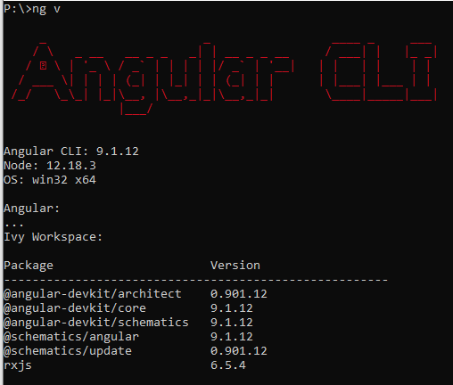

# Framework from v3.1.1 to v3.2.0


## FRONT
1. Install node-v12.18.3-x64.msi. During installation, do not check "Automatically install the necessary tools…"

2. launch following command:
•	npm uninstall -g @angular/cli
•	npm cache verify
•	npm install -g @angular/cli@9.1.12
After that, if you run the ng v command in a standard Command prompt, you should have the following output:


3. Inside the Angular folder of your project, if exist, delete the dist and node_modules folder.

4. Download this zip file:
[Angular 3.1.1 - 3.2.0.zip](./Patch/Angular%203.1.1%20-%203.2.0.zip)
Close VS Code if it is open.
Move the Angular 3.1.1 - 3.2.0.zip inside the Angular folder of your project. With 7-Zip, do Extract Here. Replace all existing file.

5. Delete the Angular 3.1.1 - 3.2.0.zip file.

6. Launch the command npm install.

7. Replace BIATemplate by the name of your project.

8. Inside all your reducer, replace all Adapter.addAll( by  Adapter.setAll(

9. For files environment.ts and environment.prod.ts, replace urlLogin: '/api/Auth/login' by urlAuth: '/api/Auth' and for the version field, remove the v and the –dev. You must have this format for example: version: '1.2.0'

10.  launch command ng lint and fix all warning/error

11.  launch command ng build –aot and fix all warning/error

12.  In case of problem “duplicate identifier IteratorResult” rum the command:   npm update --save-dev @types/node


## BACK
1. Create a project with the BIA V3.2.0 template in your folder. Check the “Place solution and project in the same directory.
   
2. Update model:
-	In TheBIADevCompany.[ProjectName].Domain project: Copy the Module folder (except SiteModule, UserModule and ViewModule) in the new Domain project.
-	In TheBIADevCompany.[ProjectName].Infrastructure.Data: 
    -	Copy the content of the Migrations Folder in the new Migrations folder.
    -	Copy the content of the ModelBuilder Folder (except SiteModelBuilder, UserModelBuilder and ViewModelBuilder) in the new ModelBuilder folder.
        -	For every IEntity class declaration add the inheritance of  VersionedTable (ex:     public class Member : VersionedTable, IEntity)
        ```csharp
            /// <summary>
            /// The member entity.
            /// </summary>
            public class Member : VersionedTable, IEntity
            {
                /// <summary>
        ```
    -	Copy the content of the Repository Folder (except GenericRepository) in the new Repository folder.
    -	Update the DataContext.cs to add missing dbset
-	Remove the deleted using (TheBIADevCompany.[ProjectName].Domain.Core …) and resolve the using.
-	Set Presentation.Api as default project, in Package console manager select default project as Infrastructure Data 
    -	run “Add-Migration FWK_3.2.0”
    -	run “Update-Database”

-	try to run the project and verify the authentication work in swagger with the BIA Log In button

3. In TheBIADevCompany.[ProjectName].Domain.DTO:
-	Copy the Service DTO folders (except BIA, Site, User and View) in the new Domain project.

4. In TheBIADevCompany.[ProjectName].Application:
-	Copy the Service folders (except BIA, Site, User and View)

5. In TheBIADevCompany.[ProjectName].Presentation.Api:
-	Copy the Controlers (exept AuthController, LogsController, MembersController, RolesController, SitesController, userController, ViewsCotroller)
-	Copy other specific folder like SignalRHub …
-	Update Startup.cs and Program.cs to add the specific service

6. In TheBIADevCompany.[ProjectName].Crosscutting.Common.Constants, Adapt in the Constants > Application class the num version to your project for BackEnd and FrontEnd.
```csharp
public static class Application
        {
            /// <summary>
            /// The back end version.
            /// </summary>
            public const string BackEndVersion = "1.2.0";

            /// <summary>
            /// The front end version.
            /// </summary>
            public const string FrontEndVersion = "1.2.0";

            /// <summary>
            /// The framework version.
            /// </summary>
            public const string FrameworkVersion = "3.2.0";
        }
```

7. Remove the deleted using (TheBIADevCompany.[ProjectName].Domain.Core …) and resolve the using.
8. Report the custom role and permission in bianetconfig.json
9. In IocContainer add all project specific collection.AddTransient<…, …>()

## DEPLOY
1. Add the step to build and deploy the service.
2. Do not connect the application before the service run else your logging will be duplicated
